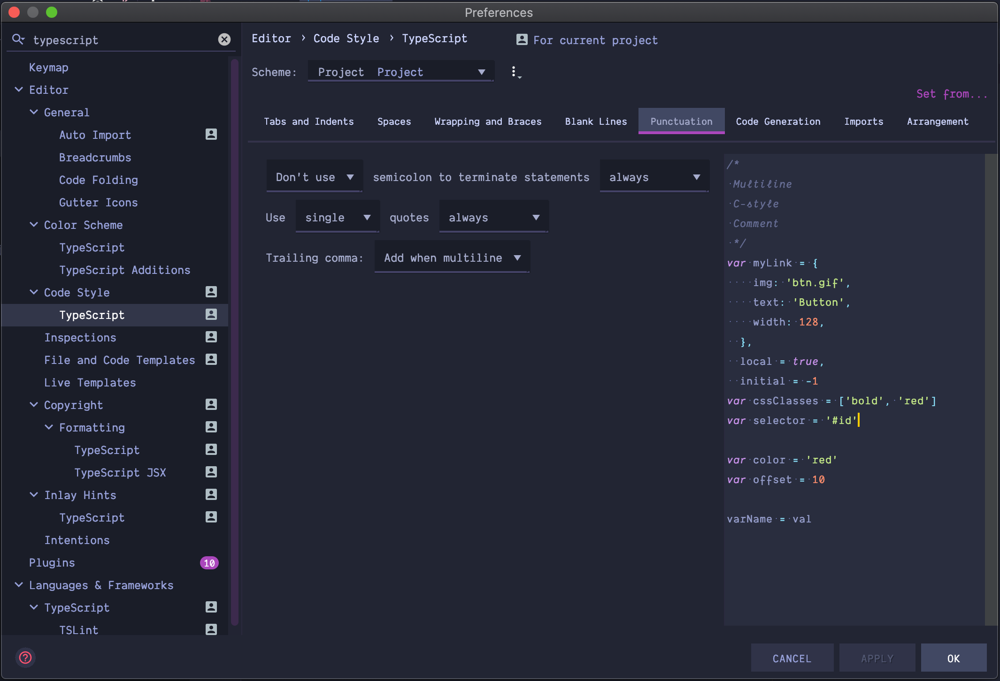

# eslint-config-typescript

[](https://travis-ci.org/baloise/eslint-config-typescript)
[](https://github.com/semantic-release/semantic-release)

ESLint shareable config for the Baloise style.

## Installation

```bash
yarn add -D eslint @typescript-eslint/eslint-plugin @typescript-eslint/parser typescript
```

Create a `.eslintrc` file with the following content.

```json
{
  "extends": ["@baloise/eslint-config-typescript"]
}
```

## Use prettier formatter

```bash
yarn add -D prettier eslint-config-prettier
```

Add `prettier` and `prettier/@typescript-eslint` to your `.eslintrc` file.

```json
{
  "extends": [
    "@baloise/eslint-config-typescript",
    "prettier",
    "prettier/@typescript-eslint"
  ]
}
```

Create a `.prettierrc` file with the following content.

```json
{
  "singleQuote": true,
  "semi": false,
  "trailingComma": "all"
}
```

Open your `package.json` and add the following script command `format`.

```json
  "scripts": {
    "format": "prettier --write \"src/**/*.ts\" \"test/**/*.ts\"",
    ...
  },
```

## Use IDEA formatter

Open preferences and navigate to `Editor -> Code Style -> TypeScript` and apply the following configurations.


